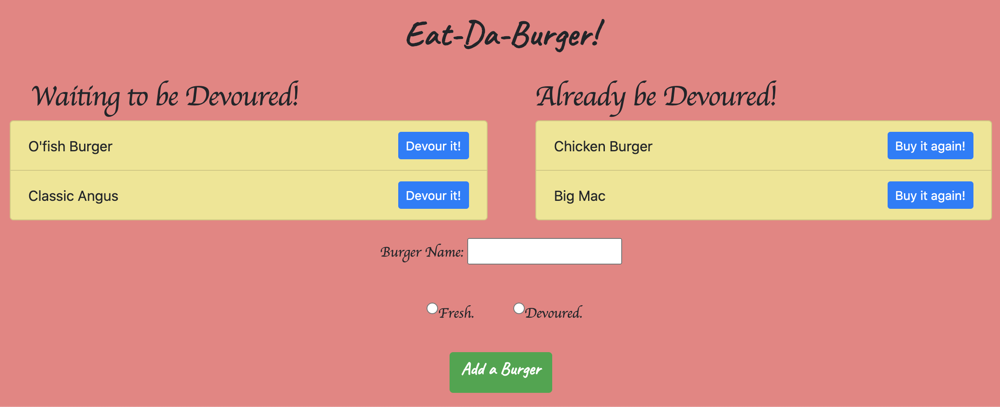

# 13-Burger-Logger


## Description



A burger logger with MySQL, Node, Express, Handlebars and a homemade ORM (yum!). Be sure to follow the MVC design pattern; use Node and MySQL to query and route data in your app, and Handlebars to generate your HTML.

Please visit [heroku](https://yozi-burger-logger-13.herokuapp.com/) and try it yourself.

## Table of Contents

-   [Installation](#Installation)
-   [Usage](#Usage)
-   [License](#License)
-   [Questions](#Questions)

## Installation

To install necessary dependencies, run the following command:

```
npm i
```

## Usage

-   Eat-Da-Burger! is a restaurant app that lets users input the names of burgers they'd like to eat.

-   Whenever a user submits a burger's name, your app will display the burger on the left side of the page -- waiting to be devoured.

-   Each burger in the waiting area also has a `Devour it!` button. When the user clicks it, the burger will move to the right side of the page.

-   Your app will store every burger in a database, whether devoured or not.

## License

This project is licensed under the MIT.

## Questions

If you have any questions about the repo, open an issue or contact me directly at jyzhu0101@gmail.com.

You can find more of my work at [Vulgarity2Elegance](https://github.com/Vulgarity2Elegance).
